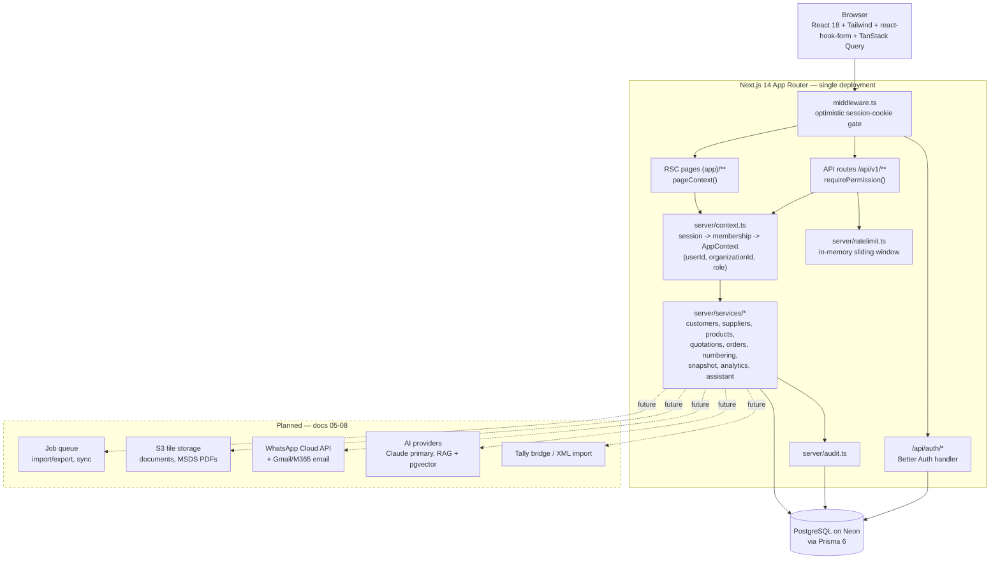

# 01 — System Architecture

**LeatherChem TMS** · Core architecture doc · v1.0 · 2026-07-29

LeatherChem TMS is a trading-management ERP/CRM for a leather chemical trading business (fatliquors, pigments, dyes, waxes, binders, finishing/retanning chemicals). It was rebuilt from a client-side JSON prototype into a production full-stack application: Next.js 14 App Router, TypeScript, PostgreSQL (Neon) via Prisma 6, Better Auth sessions, zod validation, multi-tenant with role-based access control (11 roles).

Companion docs: `02-database-schema.md`, `03-api-design.md`, `05-ai-architecture.md`, `06-tally-integration.md`, `07-whatsapp-email-integration.md`, `08-import-export.md`.

---

## 1. System Overview

One deployable unit (a Next.js monolith) talks to one PostgreSQL database. Server Components render pages directly through the service layer; client mutations go through versioned REST routes under `/api/v1`. Both paths funnel through the same context (auth + RBAC) and service layer, so tenant scoping and permissions are enforced exactly once, in one place.



The assistant today is rule-based: `/api/v1/chat` loads a tenant **snapshot** (`snapshot.ts`, one round of parallel Prisma queries, Decimals converted to numbers) and routes the question through deterministic keyword matchers (`assistant.ts`) plus a keyword doc search over `Document.content`. Doc 05 describes the planned upgrade to Claude tool-use + RAG; the routing branches become typed tools with the same semantics.

---

## 2. Tech Stack & Rationale

| Layer | Choice | Rationale |
|---|---|---|
| Framework | Next.js 14 (App Router), React 18 | One codebase for UI + API; RSC pages read through the service layer with zero client round-trips; deploys as a single unit (Vercel or Node) |
| Language | TypeScript end-to-end | Shared types between zod schemas, services, and forms |
| Database | PostgreSQL on Neon | Serverless-friendly Postgres; later enables `pgvector` for RAG (doc 05) |
| ORM | Prisma 6 | Typed queries, `$transaction` for atomic numbering/conversion, `db push`/`migrate` workflow |
| Auth | Better Auth 1.x (email/password) | Cookie sessions (7-day expiry, daily refresh), scrypt hashing, Prisma adapter; public sign-up disabled — users are provisioned by admin/seed |
| Validation | zod 4 | One schema per entity, shared by API routes (`.parse`) and react-hook-form resolvers |
| Client state | TanStack Query 5, react-hook-form | Mutations + cache invalidation; forms with zod resolvers |
| UI | Tailwind CSS 3, lucide-react, Recharts | Utility CSS, icons, dashboard charts |
| Seeding | `tsx prisma/seed.ts` | Deterministic PRNG demo data ported from the prototype; idempotent |

### Why a full-stack monolith (not a separate NestJS/Express backend)?

- **SME scale.** The target deployment is one trading company with tens of users and hundreds-to-thousands of rows per table. A separate API service adds deployment, CORS, auth-token, and versioning overhead with no payoff at this scale.
- **RSC efficiency.** Pages call services directly (`pageContext()` → `listCustomers(ctx)`) — no HTTP hop, no client fetch waterfall for initial render.
- **One security model.** Middleware + `getContext()` + the permission matrix protect pages and API routes identically.
- **The split remains possible.** All business logic lives in `src/server/services/*` behind plain async functions taking `(ctx, input)`. Route handlers are thin (parse → assert permission → call service → envelope). If the org ever needs a standalone API (mobile backend, partner integrations), the service layer lifts out into its own process without rewriting logic — routes become controllers in the new home.

---

## 3. Folder Structure

```
prisma/
  schema.prisma          # Complete DB schema (auth, tenancy, CRM, catalog, quotes/orders, inventory, audit)
  seed.ts                # Idempotent demo seed (org, users via Better Auth, full demo dataset)

src/
  middleware.ts          # Optimistic session-cookie gate; redirects to /login (UX only, not the security boundary)
  lib/
    prisma.ts            # Singleton PrismaClient
    auth.ts              # Server-side Better Auth instance (email/password, sign-up disabled)
    auth-client.ts       # Better Auth React client (login form)
    permissions.ts       # RBAC matrix: 11 roles x 22 "<module>:<action>" permissions
    validation.ts        # zod schemas: customer, activity, supplier, product, quotation, order stage, chat
    labels.ts            # Display labels, ORDER_STAGES sequence, INR formatting, date helpers
  server/
    context.ts           # getContext / requirePermission / pageContext / AuthError / errorResponse
    audit.ts             # audit(ctx, entry) -> AuditLog row; never throws into business flow
    ratelimit.ts         # In-memory sliding-window limiter (chat endpoint)
    services/
      customers.ts       # Customer CRUD + primary-contact upsert + activity logging
      suppliers.ts       # Supplier CRUD
      products.ts        # Product CRUD + price-history points + primary-supplier link
      quotations.ts      # Create (atomic numbering), status change, convert-to-order (line snapshot)
      orders.ts          # List, Kanban stage change + OrderStageEvent history
      numbering.ts       # nextNumber(tx, orgId, "QUO"|"ORD") — atomic per-org yearly sequence
      snapshot.ts        # Tenant read-model: all entities in one parallel query round, Decimal -> number
      analytics.ts       # Deterministic engine: dashboard stats, follow-ups, insights, acceptance probability
      assistant.ts       # Phase-1 rule-based assistant over the snapshot (keyword router + doc search)
  app/
    layout.tsx           # Root layout
    login/page.tsx       # Login (public)
    forbidden/page.tsx   # 403 landing for permission redirects
    api/
      auth/[...all]/route.ts       # Better Auth catch-all handler
      v1/                          # Versioned REST API (see 03-api-design.md)
        customers/  activities/  suppliers/  products/
        quotations/ orders/  chat/
    (app)/               # Authenticated shell (Sidebar layout)
      page.tsx                     # Dashboard (stats, charts, growth insights)
      customers/                   # List, detail (timeline/quotes/orders), new, edit
      suppliers/                   # List, new, edit
      products/                    # List, new, edit
      quotations/                  # List + status actions, new (line editor)
      orders/                      # Kanban board (8 stages)
      assistant/                   # Chat UI with sample questions
      audit/                       # Audit log viewer
  components/
    Sidebar.tsx  ui.tsx  Kanban.tsx  Charts.tsx  QuotationActions.tsx
    forms/               # CustomerForm, SupplierForm, ProductForm, QuotationForm, ActivityForm
```

---

## 4. Multi-Tenancy Model

Tenancy is **row-level by `organizationId`**, present on every business table.

- **`Organization`** — the tenant (name, slug, GSTIN).
- **`Membership`** — joins `User` to `Organization` with a `Role` (unique per user+org). A user's permissions are the role's entry in `ROLE_PERMISSIONS`.
- **Scoping is enforced in the service layer**, not in routes or the UI: every query filters or writes with `ctx.organizationId` from `AppContext`. Cross-tenant references are re-verified — e.g. `createQuotation` checks that the customer *and every line product* belong to the caller's org before writing.
- **`getContext()`** resolves the Better Auth session, then picks the user's first membership (`orderBy createdAt asc`). Single-company deployments have exactly one org and one membership per user, so this is deterministic.

**Deployment modes**

| Mode | Today | Later |
|---|---|---|
| Single company | One `Organization` row; every user has one membership. This is the current production shape. | — |
| SaaS (multi-org) | Schema already supports it — nothing tenant-specific is hard-coded. | *Planned:* an org switcher sets an active-org cookie which `getContext()` reads instead of "first membership"; per-org billing; `SUPER_ADMIN` cross-org tooling. |

Per-org state that must never collide is keyed accordingly: `NumberSequence` is unique on `(organizationId, key)`, quotation/order numbers on `(organizationId, number)`.

---

## 5. Request Lifecycle

### 5a. Page request (read) — `GET /customers`

1. **Middleware** checks for a Better Auth session cookie (`better-auth.session_token` or the `__Secure-` variant). Missing → redirect to `/login?from=/customers`. This is a fast UX gate only.
2. The RSC page calls **`pageContext("customers:view")`** → `requirePermission` → `getContext()`:
   - `auth.api.getSession(headers)` validates the session server-side (401 → redirect `/login`).
   - Membership lookup yields `organizationId` + `role` (none → 403 → redirect `/forbidden`).
   - `roleHas(role, "customers:view")` asserted (fail → `/forbidden`).
3. Page calls **`listCustomers(ctx)`** — Prisma query filtered by `ctx.organizationId`, includes primary contact and recent activities.
4. RSC renders HTML server-side; the browser gets the finished page. No client data fetch on first paint.

### 5b. Mutation request (write + audit) — `POST /api/v1/customers`

1. Client form (react-hook-form + zod resolver) submits JSON via TanStack Query.
2. Middleware cookie check (401 JSON if absent).
3. Route handler: **`requirePermission("customers:manage")`** — real session validation + RBAC (throws `AuthError` 401/403).
4. **`customerSchema.parse(body)`** — zod; invalid input throws, becomes a 400 with `issues`.
5. **`createCustomer(ctx, input)`** — service writes the `Customer` (with `organizationId: ctx.organizationId`, `assignedToId: ctx.userId`, optional nested primary `Contact`).
6. **`audit(ctx, {...})`** — awaited `AuditLog` write capturing action/module/entity, before/after diff snippets, IP, and user-agent. Audit failure is logged loudly but never fails the business operation.
7. Handler returns `{ data: customer }` with status 201; any thrown error is normalized by `errorResponse()` (see doc 03).

Transactional mutations (quotation create, quotation→order convert, order stage change) wrap the write plus its side effects (`NumberSequence` increment, `OrderStageEvent` insert) in `prisma.$transaction`.

---

## 6. Module Map

### Implemented now

| Module | Surface | Notes |
|---|---|---|
| Dashboard | `(app)/page.tsx` | Stats, revenue-by-category & top-customer charts, deterministic growth insights (`analytics.ts`) |
| CRM (Customers) | `customers/*`, `/api/v1/customers`, `/api/v1/activities` | Companies, contacts, GSTIN/PAN validation, activity timeline, 45-day follow-up rule |
| Suppliers | `suppliers/*`, `/api/v1/suppliers` | Ratings (quality 0–5, reliability %, delivery days), price history models |
| Products | `products/*`, `/api/v1/products` | 7 chemical categories, cost/sell price with history points, primary-supplier link, MSDS/tech-sheet text |
| Quotations | `quotations/*`, `/api/v1/quotations` | Line editor, GST %, atomic QUO-YYYY-NNN numbering, status lifecycle, acceptance-probability score |
| Orders | `orders/*`, `/api/v1/orders` | 8-stage Kanban with full `OrderStageEvent` transition history; created by converting quotations |
| Assistant | `assistant/`, `/api/v1/chat` | Rule-based Phase 1 (snapshot + keyword router + doc search), rate-limited |
| Audit | `audit/` | Every create/update/status/stage/convert action logged with before/after, IP, UA |

### Designed-for-later (schema and/or design docs exist; no UI/routes yet)

| Module | Foundation today | Design doc |
|---|---|---|
| Inventory UI | `Warehouse`, `StockItem`, `StockMovement` models + `inventory:view/manage` permissions already exist | — |
| Purchase orders | `PURCHASE` role + supplier/pricing models | — |
| Invoices & Payments | Order stage `PAYMENT_RECEIVED`; `DocumentType.INVOICE` | doc 06 (Tally is the accounting system of record) |
| Import Centre / Export Centre | Audit `action: "import"` reserved | doc 08 (formats, wizard, undo, scheduled exports) |
| Tally integration | — | doc 06 (XML file upload P0, local bridge agent P2) |
| WhatsApp & Email | `Contact.whatsapp`, `ActivityType.WHATSAPP/EMAIL` timeline events | doc 07 (Meta Cloud API, unified inbox) |
| AI assistant (LLM + RAG) | Snapshot + service layer become typed tools; `Document.content` becomes chunked embeddings | doc 05 (Claude primary, pgvector, permission-filtered retrieval) |
| File storage | `Document.fileUrl`/`mimeType` fields ready | doc 05/08 (S3 or compatible) |

---

## 7. Extension Points

The architecture adds modules by pattern, not by framework change. A new module is: Prisma models (with `organizationId`) → zod schemas → service file → `/api/v1/<module>` routes → `(app)/<module>` pages → new `"<module>:<action>"` permissions wired into the role matrix.

- **HR module** — add `Employee`, `Attendance`, `Payroll` models; new `hr:*` permissions; the existing `Role` enum can grow (Prisma enum migration) or HR can define its own sub-roles. Audit and tenancy come for free through `ctx` + `audit()`.
- **Manufacturing / repacking** — builds on the inventory foundation: `BillOfMaterials`, `ProductionBatch` referencing `StockItem`/`StockMovement` (`ADJUSTMENT` type already exists). Batch/expiry tracking is already modeled (`StockItem.batchNo`, `expiryDate`).
- **Customer portal** — a separate route group (`(portal)/`) with its own auth surface. Better Auth supports multiple session scopes; portal users get a `Membership`-like table with a customer-scoped role, and services gain a `customerId`-scoped context variant. Quotation `VIEWED` status is a natural first integration (customer opens a quote → status flips).
- **Mobile app** — the versioned `/api/v1` JSON API is the contract. Better Auth issues bearer-compatible sessions; the same permission checks apply. If load or team structure demands it, `src/server/services/*` extracts into a standalone API service (see §2).
- **Background jobs** — *planned:* imports, scheduled exports, Tally sync, and WhatsApp sends (docs 06–08) run through a queue (Vercel cron + DB-backed jobs first, dedicated queue later). Services stay synchronous; queue workers call the same service functions with a system-constructed `AppContext`.
