# 02 — Database Schema

**LeatherChem TMS** · Database reference · v1.0 · 2026-07-29

Source of truth: `prisma/schema.prisma`. PostgreSQL (Neon) via Prisma 6. All IDs are `cuid()` strings. Every business table carries `organizationId` for row-level multi-tenancy. Money is `Decimal(14,2)` in INR.

---

## 1. Entity-Relationship Diagram

```mermaid
erDiagram
    User ||--o{ Session : "has"
    User ||--o{ Account : "has"
    User ||--o{ Membership : "member of"
    Organization ||--o{ Membership : "has members"
    Organization ||--o{ NumberSequence : "owns"

    Organization ||--o{ Customer : "owns"
    Organization ||--o{ Supplier : "owns"
    Organization ||--o{ Product : "owns"
    Organization ||--o{ Quotation : "owns"
    Organization ||--o{ Order : "owns"
    Organization ||--o{ Warehouse : "owns"
    Organization ||--o{ Document : "owns"
    Organization ||--o{ Invoice : "owns"
    Organization ||--o{ Payment : "owns"
    Organization ||--o{ PurchaseOrder : "owns"
    Organization ||--o{ ImportBatch : "owns"
    Organization ||--o{ AuditLog : "owns"

    User ||--o{ Customer : "assigned salesperson"
    Customer ||--o{ Contact : "has"
    Customer ||--o{ ActivityEvent : "timeline"
    User ||--o{ ActivityEvent : "logged by"

    Supplier ||--o{ SupplierProduct : "offers"
    Product ||--o{ SupplierProduct : "offered by"
    Supplier ||--o{ SupplierPrice : "quoted"
    Product ||--o{ SupplierPrice : "for"
    Product ||--o{ ProductPrice : "price history"

    Customer ||--o{ Quotation : "receives"
    User ||--o{ Quotation : "created by"
    Quotation ||--o{ QuotationLine : "contains"
    Product ||--o{ QuotationLine : "priced in"
    Quotation ||--o{ Order : "converts to"

    Customer ||--o{ Order : "places"
    Order ||--o{ OrderLine : "contains"
    Product ||--o{ OrderLine : "sold in"
    Order ||--o{ OrderStageEvent : "stage history"
    User ||--o{ OrderStageEvent : "changed by"

    Order ||--o{ Invoice : "billed by"
    Customer ||--o{ Invoice : "owes on"
    Invoice ||--o{ Payment : "settled by"
    Customer ||--o{ Payment : "pays"

    Supplier ||--o{ PurchaseOrder : "receives"
    User ||--o{ PurchaseOrder : "raised by"
    PurchaseOrder ||--o{ PurchaseOrderLine : "contains"
    Product ||--o{ PurchaseOrderLine : "bought in"

    Warehouse ||--o{ StockItem : "holds"
    Product ||--o{ StockItem : "stocked as"
    Warehouse ||--o{ StockMovement : "moves"
    Product ||--o{ StockMovement : "moved"

    Product ||--o{ Document : "attached to"
    Customer ||--o{ Document : "attached to"
    Supplier ||--o{ Document : "attached to"
    User ||--o{ Document : "uploaded by"
    User ||--o{ ImportBatch : "ran"
    User ||--o{ AuditLog : "acted"
```

`ImportBatch` has no FK from the rows it creates: `Customer.importBatchId`, `Supplier.importBatchId`, and `Product.importBatchId` are **plain nullable string stamps**, not relations (see §3, *Import batch stamping*).

(`Verification` is a standalone Better Auth table with no relations.)

---

## 2. Table Reference

### 2.1 Auth & Tenancy

| Model (table) | Purpose | Key fields | Relations / indexes |
|---|---|---|---|
| `User` (`user`) | Better Auth user. Provisioned by admin/seed — public sign-up disabled. | `email` (unique), `name`, `emailVerified` | → sessions, accounts, memberships, assigned customers, quotations created, stage events, audit logs |
| `Session` (`session`) | Cookie session (7-day expiry, refreshed daily). | `token` (unique), `expiresAt`, `ipAddress`, `userAgent` | FK user (Cascade); index `userId` |
| `Account` (`account`) | Credential/provider record; `password` holds the scrypt hash for email/password. | `providerId`, `accountId`, `password` | FK user (Cascade); index `userId` |
| `Verification` (`verification`) | Better Auth verification tokens (email flows). | `identifier`, `value`, `expiresAt` | none |
| `Organization` | The tenant. One row for single-company deployment; many for SaaS. | `name`, `slug` (unique), `gstin` | parent of every business table |
| `Membership` | User↔org join carrying the RBAC `Role` (11 values: `SUPER_ADMIN`, `OWNER`, `SALES_MANAGER`, `SALES_EXECUTIVE`, `ACCOUNTS`, `PURCHASE`, `WAREHOUSE`, `OPERATIONS`, `SUPPORT`, `MANAGEMENT`, `AUDITOR`). | `role` | unique `(userId, organizationId)`; index `organizationId`; Cascade both FKs |
| `NumberSequence` | Per-org counter behind human-readable document numbers. | `key` (e.g. `"QUO-2026"`), `next` | unique `(organizationId, key)` |

### 2.2 CRM

| Model | Purpose | Key fields | Relations / indexes |
|---|---|---|---|
| `Customer` | Buying company (tannery, footwear, leather goods). | `companyName`, `gstin`, `pan`, `industry`, `country`, `creditLimit` Dec(14,2), `paymentTerms`, `preferredCategories` (`ProductCategory[]`), `annualPurchaseValue` Dec(14,2), `assignedToId`, `importBatchId?` | FK org (Cascade), assignedTo User (SetNull); index `(organizationId, companyName)` |
| `Contact` | Person at a customer; one flagged `isPrimary`. | `name`, `designation`, `email`, `phone`, `whatsapp`, `isPrimary` | FK customer (Cascade); index `customerId` |
| `ActivityEvent` | CRM timeline entry; drives the 45-day follow-up rule. `ActivityType`: `CALL`, `EMAIL`, `MEETING`, `NOTE`, `FOLLOWUP`, `WHATSAPP`. | `type`, `date`, `summary` | FK org/customer (Cascade), user (SetNull); indexes `(customerId, date)`, `(organizationId, type, date)` |

`ProductCategory` enum (shared with products): `FATLIQUORS`, `PIGMENTS`, `DYES`, `WAXES`, `BINDERS`, `FINISHING_CHEMICALS`, `RETANNING_CHEMICALS`.

### 2.3 Suppliers & Products

| Model | Purpose | Key fields | Relations / indexes |
|---|---|---|---|
| `Supplier` | Chemical manufacturer/vendor with performance scores. | `name`, `country`, `avgDeliveryDays`, `qualityRating` Dec(3,1) 0–5, `reliabilityScore` Int 0–100, `importBatchId?` | FK org (Cascade); index `(organizationId, name)`; → documents, purchase orders |
| `Product` | Catalog item. | `name`, `category`, `unit` (default `kg`), `hsnCode`, `purchaseCost` / `sellingPrice` Dec(14,2), `technicalSheet` / `msds` (text), `importBatchId?` | FK org (Cascade); index `(organizationId, category)` |
| `SupplierProduct` | M:N supplier↔product with a primary-supplier flag and sourcing terms. | `isPrimary`, `moq` Dec(14,2), `leadTimeDays` | unique `(supplierId, productId)`; index `productId`; Cascade both |
| `SupplierPrice` | A supplier's quoted purchase price over time (per product). | `date`, `price` Dec(14,2) | indexes `(productId, date)`, `(supplierId, productId)`; Cascade both |
| `ProductPrice` | Our own cost/sell price history — a point is appended whenever product pricing changes (`products.ts`). | `date`, `purchaseCost`, `sellingPrice` | index `(productId, date)`; Cascade |

### 2.4 Quotations & Orders

| Model | Purpose | Key fields | Relations / indexes |
|---|---|---|---|
| `Quotation` | Sales quote. `QuotationStatus`: `DRAFT` → `SENT` → `VIEWED` → `ACCEPTED` / `REJECTED`. | `number` (QUO-YYYY-NNN), `status`, `validUntil`, `notes`, `createdById` | FK org (Cascade), **customer (Restrict)**, createdBy (SetNull); unique `(organizationId, number)`; indexes `(organizationId, status)`, `customerId` |
| `QuotationLine` | Line item with commercial detail. | `qty`, `unitPrice`, `discountPct` Dec(5,2), `taxPct` Dec(5,2) default 18 (GST) | FK quotation (Cascade), **product (Restrict)**; index `quotationId` |
| `Order` | Sales order, tracked on an 8-stage Kanban. `OrderStage`: `INQUIRY_RECEIVED`, `SUPPLIER_CONFIRMED`, `QUOTATION_SENT`, `PO_RECEIVED`, `SUPPLIER_ORDERED`, `DISPATCHED`, `DELIVERED`, `PAYMENT_RECEIVED`. | `number` (ORD-YYYY-NNN), `stage`, `expectedDelivery`, `quotationId?` | FK org (Cascade), **customer (Restrict)**, quotation (SetNull); unique `(organizationId, number)`; indexes `(organizationId, stage)`, `customerId` |
| `OrderLine` | Line **snapshotted** from the quotation at conversion time. | `qty`, `unitPrice` | FK order (Cascade), **product (Restrict)**; index `orderId` |
| `OrderStageEvent` | Full transition history behind the Kanban (who moved what, when, from→to). | `fromStage?` (null = creation), `toStage`, `changedById`, `changedAt` | FK order (Cascade), changedBy (SetNull); index `(orderId, changedAt)` |

### 2.5 Purchase Orders & Goods Receipt

| Model | Purpose | Key fields | Relations / indexes |
|---|---|---|---|
| `PurchaseOrder` | Buy-side order to a supplier. `PurchaseOrderStatus`: `DRAFT` → `SENT` → `CONFIRMED` → `PARTIALLY_RECEIVED` → `RECEIVED`, or `CANCELLED`. | `number` (PO-YYYY-NNN via `NumberSequence`), `status`, `expectedDate?`, `notes?`, `createdById?` | FK org (Cascade), **supplier (Restrict)**, createdBy (SetNull); unique `(organizationId, number)`; index `(organizationId, status)` |
| `PurchaseOrderLine` | Ordered line with running receipt progress. `receivedQty` is incremented by goods receipt and compared against `qty` to decide `PARTIALLY_RECEIVED` vs `RECEIVED`. | `qty`, `unitCost`, `receivedQty` (default 0) — all Dec(14,2) | FK purchaseOrder (Cascade), **product (Restrict)**; index `purchaseOrderId` |

Goods receipt (`receiveGoods` in `purchases.ts`) validates every receipt line against outstanding quantity *before* writing anything, then in **one transaction** increments `receivedQty`, upserts the matching `StockItem` (warehouse + product + batch), writes an `IN` `StockMovement` with `refType: "purchase"` / `refId: <poId>`, and re-evaluates the PO status. This is the only path that creates inbound stock, so every unit in inventory traces back to a PO line.

### 2.6 Invoices & Payments

Accounting-lite: these are **records** for the collections view, not statutory books — Tally remains the book of record (doc 06).

| Model | Purpose | Key fields | Relations / indexes |
|---|---|---|---|
| `Invoice` | Customer invoice, optionally against an order. `InvoiceStatus`: `ISSUED`, `PAID`, `CANCELLED`. | `number` (INV-YYYY-NNN), `amount` Dec(14,2) **pre-tax**, `taxAmount` Dec(14,2), `status`, `issuedAt`, `dueDate?`, `notes?` | FK org (Cascade), order (SetNull), **customer (Restrict)**; unique `(organizationId, number)`; indexes `(organizationId, status)`, `customerId` |
| `Payment` | Receipt against an invoice, or an on-account payment from a customer. `PaymentMethod`: `BANK_TRANSFER`, `UPI`, `CHEQUE`, `CASH`, `OTHER`. | `amount` Dec(14,2), `method`, `date`, `reference?`, `notes?` | FK org (Cascade), invoice (SetNull), **customer (Restrict)**; indexes `(organizationId, date)`, `invoiceId` |

`Payment.invoiceId` is nullable and `SetNull` on delete: an advance or on-account receipt is a real event even before it is matched to an invoice, and voiding an invoice must never erase the money that came in.

### 2.7 Inventory

| Model | Purpose | Key fields | Relations / indexes |
|---|---|---|---|
| `Warehouse` | Physical storage location. | `name`, `location` | FK org (Cascade); index `organizationId` |
| `StockItem` | Batch-level stock position with reorder and expiry tracking. | `batchNo?`, `qty` Dec(14,2), `reorderLevel?`, `expiryDate?` | unique `(warehouseId, productId, batchNo)`; index `(organizationId, productId)`; Cascade all |
| `StockMovement` | Ledger of stock changes. `StockMovementType`: `IN`, `OUT`, `RETURN`, `ADJUSTMENT`. Polymorphic reference via `refType`/`refId` (`"order"`, `"purchase"`, …). | `type`, `qty`, `date`, `refType?`, `refId?`, `notes?` | index `(organizationId, productId, date)`; Cascade all |

### 2.8 Documents & Audit

| Model | Purpose | Key fields | Relations / indexes |
|---|---|---|---|
| `Document` | File store **and** the assistant's knowledge base. `DocumentType`: `MSDS`, `TECHNICAL_SHEET`, `CATALOG`, `QUOTATION`, `INVOICE`, `PRICE_LIST`, `CONTRACT`, `CERTIFICATE`, `OTHER`. `content` holds extracted plain text (PDF via `pdf-parse`, text/CSV/markdown decoded directly, capped at 200k chars) — this is what the assistant searches and cites. `fileData` holds the raw bytes **in Postgres** (§3). | `title`, `type`, `content?`, `fileData?` (`Bytes`), `fileName?`, `mimeType?`, `sizeBytes?`, `uploadedById?`, `uploadedAt` | FK org (Cascade), product/customer/**supplier**/uploadedBy (SetNull); indexes `(organizationId, type)`, `(organizationId, uploadedAt)` |
| `AuditLog` | Immutable action trail written by `server/audit.ts` on every mutation. | `action` (`create`/`update`/`delete`/`stage_change`/`status_change`/`convert`/`goods_receipt`/`import`/`import_undo`/`export`/…), `module`, `entityType`, `entityId`, `before` Json?, `after` Json?, `ip`, `userAgent` | FK org (Cascade), user (SetNull); indexes `(organizationId, createdAt)`, `(organizationId, entityType, entityId)` |

### 2.9 Import Centre

| Model | Purpose | Key fields | Relations / indexes |
|---|---|---|---|
| `ImportBatch` | One committed import run — the unit of undo. `ImportModule`: `CUSTOMERS`, `SUPPLIERS`, `PRODUCTS`. `ImportStatus`: `COMMITTED`, `UNDONE`. | `module`, `status`, `fileName`, `sourceFormat` (`"csv"` \| `"xlsx"` \| `"tally-xml"`), `createdCount`, `skippedCount`, `errorCount`, `mapping` Json?, `createdById?`, `undoneAt?` | FK org (Cascade), createdBy (SetNull); index `(organizationId, createdAt)` |

Every row a batch creates carries that batch's id in `Customer.importBatchId` / `Supplier.importBatchId` / `Product.importBatchId`, which is what makes undo an exact reversal (§3).

### 2.10 Enum Index

| Enum | Values |
|---|---|
| `Role` | `SUPER_ADMIN`, `OWNER`, `SALES_MANAGER`, `SALES_EXECUTIVE`, `ACCOUNTS`, `PURCHASE`, `WAREHOUSE`, `OPERATIONS`, `SUPPORT`, `MANAGEMENT`, `AUDITOR` |
| `ProductCategory` | `FATLIQUORS`, `PIGMENTS`, `DYES`, `WAXES`, `BINDERS`, `FINISHING_CHEMICALS`, `RETANNING_CHEMICALS` |
| `ActivityType` | `CALL`, `EMAIL`, `MEETING`, `NOTE`, `FOLLOWUP`, `WHATSAPP` |
| `QuotationStatus` | `DRAFT`, `SENT`, `VIEWED`, `ACCEPTED`, `REJECTED` |
| `OrderStage` | `INQUIRY_RECEIVED`, `SUPPLIER_CONFIRMED`, `QUOTATION_SENT`, `PO_RECEIVED`, `SUPPLIER_ORDERED`, `DISPATCHED`, `DELIVERED`, `PAYMENT_RECEIVED` |
| `PurchaseOrderStatus` | `DRAFT`, `SENT`, `CONFIRMED`, `PARTIALLY_RECEIVED`, `RECEIVED`, `CANCELLED` |
| `InvoiceStatus` | `ISSUED`, `PAID`, `CANCELLED` |
| `PaymentMethod` | `BANK_TRANSFER`, `UPI`, `CHEQUE`, `CASH`, `OTHER` |
| `StockMovementType` | `IN`, `OUT`, `RETURN`, `ADJUSTMENT` |
| `DocumentType` | `MSDS`, `TECHNICAL_SHEET`, `CATALOG`, `QUOTATION`, `INVOICE`, `PRICE_LIST`, `CONTRACT`, `CERTIFICATE`, `OTHER` |
| `ImportModule` | `CUSTOMERS`, `SUPPLIERS`, `PRODUCTS` |
| `ImportStatus` | `COMMITTED`, `UNDONE` |

---

## 3. Design Decisions

### Decimal(14,2) for money, `Number()` at the service boundary
All monetary and quantity columns are `Decimal(14,2)` (Postgres `numeric`) so the database never accumulates float error and sums/comparisons in SQL are exact. Prisma surfaces these as `Decimal` objects, which don't serialize or arithmetic cleanly in JS — so the convention is: **convert with `Number(...)` the moment values leave Prisma** (see `snapshot.ts`, which guarantees "nothing downstream sees Prisma types", and audit before/after payloads). At Decimal(14,2)/INR scale, `Number()` conversion is lossless for realistic values.

### Enums for statuses
`Role`, `ProductCategory`, `ActivityType`, `QuotationStatus`, `OrderStage`, `PurchaseOrderStatus`, `InvoiceStatus`, `PaymentMethod`, `StockMovementType`, `DocumentType`, `ImportModule`, `ImportStatus` are Prisma enums → Postgres enum types (full value list in §2.10). Invalid states are rejected by the database itself, the zod schemas mirror the same literals, and TypeScript gets exhaustive unions for free. Trade-off: adding a value requires a migration — acceptable because these vocabularies change rarely and deliberately.

### OrderLine snapshots vs referencing quotation lines
`convertToOrder` **copies** `productId`/`qty`/`unitPrice` from `QuotationLine` into new `OrderLine` rows rather than pointing the order at the quotation's lines. Rationale: an order is a commercial commitment — later edits to the quotation (or a re-quote) must never mutate what was actually ordered. The order still keeps a soft link (`Order.quotationId`, SetNull) for provenance. Note the snapshot intentionally drops `discountPct`/`taxPct`: the order line's `unitPrice` is the agreed price; tax presentation belongs to the (future) invoice.

### OrderStageEvent transition history
The Kanban's current column is `Order.stage`, but every move also appends an `OrderStageEvent` (`fromStage` → `toStage`, `changedById`, timestamp) inside the same transaction (`orders.ts`). This gives cycle-time analytics, accountability, and back-tracking without event-sourcing the whole order. Creation writes the first event with `fromStage: null`.

### File bytes in Postgres (`Document.fileData Bytes?`) — and when to stop
Uploaded files are stored as a `Bytes` column on `Document`, not as an object-storage key. This is a deliberate, reversible choice:

- **It works with zero external services.** No S3 bucket, no credentials, no CORS policy, no signed-URL expiry logic, no second thing to back up or restore. `pg_dump` captures the documents along with the rows that reference them, so the disaster-recovery story stays one artifact (doc 09 §7).
- **Deletes and tenancy are free.** A document's bytes cascade with its `Organization`; there is no orphan-object reaper and no window where a row is gone but the file is not.
- **The bounds are enforced, not hoped for.** The upload route caps files at **8 MB** and restricts MIME types to an allowlist (PDF, text/CSV/markdown, PNG/JPEG/WebP, Word, Excel), so a single row cannot become pathological. Postgres TOASTs the column out of the main heap, and no query that lists documents selects `fileData` — `listDocuments` selects an explicit field list, so table scans never drag bytes through memory.
- **The realistic volume justifies it.** An SME chemical trader accumulates MSDS sheets, tech sheets, price lists, and certificates — hundreds of files, tens of MB, not a media library.

**Migration trigger — move to S3 (or any S3-compatible store) when any of these becomes true:** total document bytes approach the database plan's storage or backup window (Neon free tier storage is the near-term ceiling), dumps/restores become slow enough to disrupt the backup routine, users need files larger than 8 MB, or documents need to be served directly to browsers at CDN scale. **Migration path:** add `storageKey String?` alongside `fileData`, write new uploads to the bucket, backfill existing rows in a job, then make `getDocumentFile` prefer `storageKey` and fall through to `fileData`. Nothing above the service layer changes — the download route already streams from a single function, and the same sandboxing response headers apply either way (doc 04).

### Import batch stamping instead of a foreign key
`Customer.importBatchId`, `Supplier.importBatchId`, and `Product.importBatchId` are nullable **plain strings**, not relations to `ImportBatch`. Rationale: the stamp exists so undo can delete exactly what a batch created (`deleteMany({ where: { organizationId, importBatchId } })`) and so a row's provenance survives. A real FK would force a choice between cascading (deleting a batch record would silently delete real business data) and restricting (batch records could never be pruned). A soft stamp keeps undo precise, keeps hand-entered rows — which have `importBatchId: null` — untouchable by any undo, and lets batch history be archived independently of the data it produced. Undo additionally **refuses** rather than cascades: if any imported customer already has quotations/orders/invoices, or any imported product appears on a quotation or order line, `undoImport` throws `UndoBlockedError` (409) instead of deleting business documents.

### NumberSequence for QUO/ORD/PO/INV numbering
Human-readable numbers (`QUO-2026-001`) can't come from cuids or DB sequences (per-org, per-year, gap-tolerant reset). `nextNumber(tx, orgId, prefix)` — `prefix` is `"QUO" | "ORD" | "INV" | "PO"` — upserts `NumberSequence` keyed `(organizationId, "QUO-2026")` with `next: { increment: 1 }` **inside the caller's transaction** — the row lock serializes concurrent allocations, so no duplicates; the unique `(organizationId, number)` constraint on Quotation/Order/Invoice/PurchaseOrder is the backstop.

### Cascade vs Restrict vs SetNull
- **Cascade from `Organization`** everywhere: deleting a tenant removes all of its data — correct for tenancy, and impossible to half-delete.
- **Cascade for composition**: children that are meaningless without their parent (Contact→Customer, QuotationLine→Quotation, OrderLine→Order, StageEvent→Order, StockItem→Warehouse, PurchaseOrderLine→PurchaseOrder).
- **Restrict for commercial history**: `Quotation.customer`, `Order.customer`, `Invoice.customer`, `Payment.customer`, `PurchaseOrder.supplier`, `QuotationLine.product`, `OrderLine.product`, `PurchaseOrderLine.product`. You cannot delete a customer, supplier, or product that appears in commercial documents — the paper trail wins. (Practically, entities are edited, not deleted; the only delete endpoints are documents and import undo, both of which are guarded.)
- **SetNull for attribution**: `assignedTo`, `createdBy`, `changedBy`, `uploadedBy`, `AuditLog.user`, `ImportBatch.createdBy`, `Order.quotationId`, `Invoice.orderId`, `Payment.invoiceId`, and all `Document` links (product/customer/supplier). Removing a user or source must never destroy business records — the reference just goes anonymous.

### Migration strategy
- **Development:** `npm run db:push` (`prisma db push`) — fast schema iteration against a dev Neon branch, no migration files; `npm run db:seed` (idempotent — wipes and regenerates the demo org) restores data after destructive pushes.
- **Production:** switch to `prisma migrate` — `npm run db:migrate` (`prisma migrate dev`) generates SQL migration files locally; `prisma migrate deploy` applies them in CI/CD. Neon branching allows rehearsing a migration on a copy of production data before deploy. Rule: once the first production deploy happens, every schema change goes through a committed migration file — `db push` remains dev-only.
